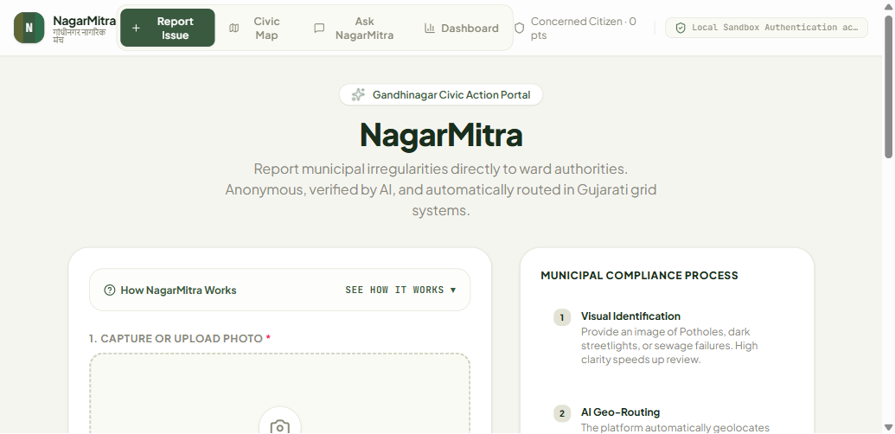
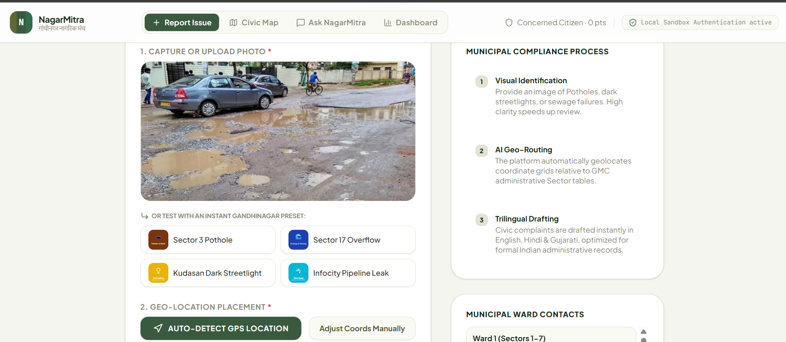
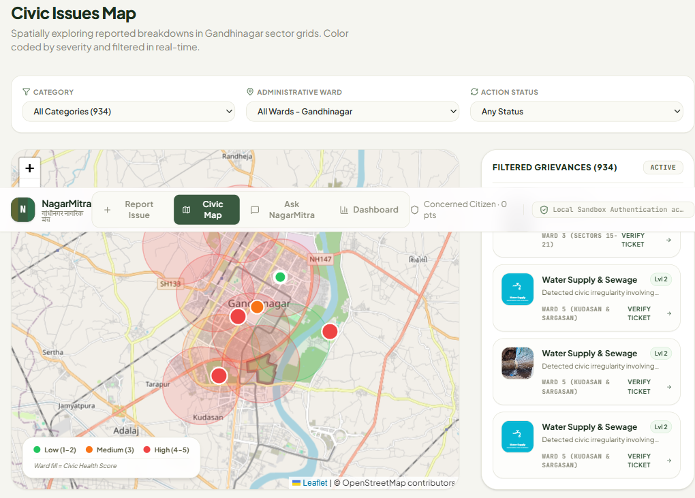
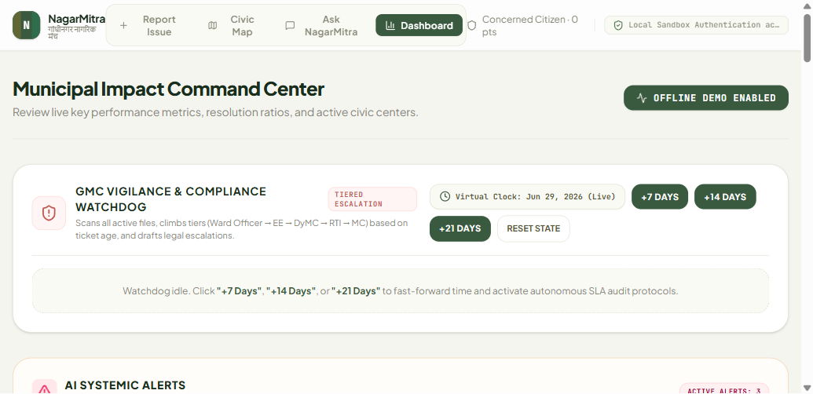
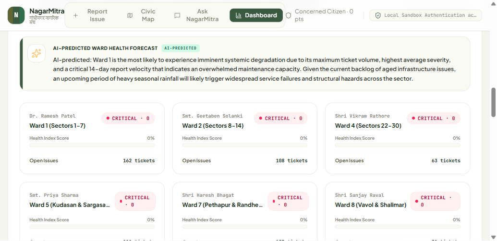
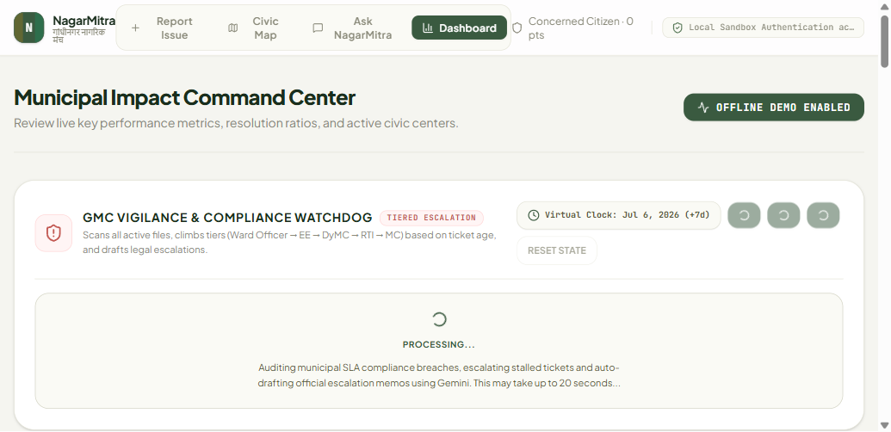

# NagarMitra — Community Hero

**Vibe2Ship Hackathon | Coding Ninjas × Google for Developers | Problem Statement 2**

An agentic civic issue resolver for the Gandhinagar Municipal Corporation. Citizens photograph a pothole, water leak, or broken streetlight — NagarMitra classifies it using Gemini Vision, routes it to the correct GMC officer, and autonomously escalates it through the real municipal hierarchy (EE → DyMC → RTI + SWAGAT 2.0 + CPGRAMS → Commissioner) until resolved.

**Live App:** https://nagarmitra-967605381609.asia-southeast1.run.app/  
**Submitted by:** Sankalp Turankar | IIT Gandhinagar | sankalp.turankar@iitgn.ac.in

---

## Screenshots

**Report Issue — Landing Page**  


**Photo Upload with Gandhinagar Presets**  
)

**Civic Map — Real Gandhinagar Streets, Severity-Colored Pins, Ward Overlays**  


**Dashboard — Municipal Impact Command Center + Escalation Watchdog**  


**GMC Ward Civic Health Index — AI-Predicted, Per-Ward Scores**  


**Autonomous Escalation Watchdog — +7 Day Simulation (Live Gemini Processing)**  


---

## What It Does

- **Photo → complaint in 30 seconds** — Gemini 2.0 Flash classifies issue type, severity 1–5, and specific hazards from one photo
- **Autonomous escalation watchdog** — Day 7 → EE, Day 14 → DyMC, Day 21 → RTI + SWAGAT 2.0 + CPGRAMS, Day 28 → Commissioner; zero user trigger required
- **Co-witness amplifier** — duplicate reports within 60m merge into the original complaint, adding the citizen as a co-witness
- **Ward Civic Health Index** — per-ward score (0–100) updated from live ticket data; surfaces wards trending toward failure before crisis
- **Trilingual throughout** — English, Hindi, Gujarati across complaint drafts, escalation notices, and civic chat
- **Voice-first reporting** — Web Speech API (hi-IN / gu-IN / en-IN) lowers the literacy barrier
- **AI-wired gamification** — Civic Contribution Score tied directly to Gemini severity output

---

## Agentic Architecture

Six-agent `plan → tool-call → reflect` loop:

| Agent | Role |
|---|---|
| Vision Analyst | Gemini 2.0 Flash multimodal — classifies photo, self-corrects if confidence < 0.6 |
| Geo-Router | Maps GPS coordinates to GMC ward + department + officer designation |
| Duplicate Detector | Haversine ≤ 60m + same category → merge as co-witness |
| Complaint Drafter | Trilingual formal complaint via Gemini (real IDs injected, none fabricated) |
| Escalation Watchdog | Autonomous SLA monitor — climbs hierarchy as deadlines lapse |
| Systemic Pattern Detector | Detects cluster patterns per ward, auto-drafts root-cause bulletins |

---

## Google Technologies Used

| Technology | Usage |
|---|---|
| Google AI Studio | Core build + deploy tool (Build mode, 7 days of prompts) |
| AI Studio "Analyse images" chip | Gemini multimodal vision for civic photo classification |
| AI Studio "Transcribe audio" chip | Voice-first reporting in three languages |
| AI Studio "Use Google Search data" chip | Search grounding on all legal citations |
| Gemini 2.0 Flash | Primary model for vision + agentic orchestration |
| Gemini 1.5 Flash | Fallback model (separate quota pool) |
| Google Maps Platform | GPS location + reverse geocoding → GMC ward ID |
| @google/genai SDK | All server-side Gemini calls |
| Firebase Firestore (Spark) | Ticket persistence + escalation history |
| Google Cloud Run | Serverless hosting (free Starter tier) |

---

## Run Locally

**Prerequisites:** Node.js

```bash
npm install
```

Set `GEMINI_API_KEY` in `.env.local`:

```
GEMINI_API_KEY=your_key_here
```

```bash
npm run dev
```

> `.env.local` is gitignored. Never commit API keys.

---

## Tech Stack

| Layer | Technology |
|---|---|
| Frontend | React (AI Studio–generated scaffold) |
| Backend | Node.js / Express |
| AI Models | Gemini 2.0 Flash + 1.5 Flash fallback |
| Location | Google Maps Platform (GPS + reverse geocoding) |
| Map display | Leaflet.js + OpenStreetMap |
| Database | Firebase Firestore (Spark) + localStorage fallback |
| Deployment | Google Cloud Run (free Starter tier) |
| Security | HMAC-SHA256 session tokens, sliding-window rate limiter, 5-layer input validation |


<!-- <div align="center">

</div>

# Run and deploy your AI Studio app

This contains everything you need to run your app locally.

View your app in AI Studio: https://ai.studio/apps/2f0bfd08-9cda-42bd-b1bf-ed2148973ba0

## Run Locally

**Prerequisites:**  Node.js


1. Install dependencies:
   `npm install`
2. Set the `GEMINI_API_KEY` in [.env.local](.env.local) to your Gemini API key
3. Run the app:
   `npm run dev` -->
